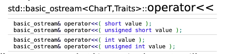
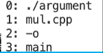

# 简单的输入与输出

## C++风格

### 输出

在c++中我们使用cout进行输出，使用是需要包含iostream头文件

cout定义如下

```c++
std::ostream cout;
```

由此可见，cout是std命名空间中的一种ostream的一种数据对象

使用cout输出的示例如下

```c++
cout << "hello." << endl;
```

其中<<是一种操作符定义如下



endl可以输出一个换行符

### 输入

在c++中我们使用cin进行输出，cin是std命名空间中istream的一种对象

示例如下

```c++
cin >> a;
// >>同样为操作符
```

## C风格

### 输出

c语言输出示例如下

```c
int v = 100;
printf("Hello, value = %d\n", v);
```

具体可以查阅手册qwq

### 输入

输入示例如下

```
int v;
int ret = scanf("%d", &v)
```

注意v前&为取址符，c语言中使用scanf输入需要传入变量地址

## 命令行参数

```shell
g++ hello.cpp -o hello
```

在上述指令中g++为确切的可执行程序，hello.cpp,-o和hello为三个参数

我们的main函数实际上有两个参数，示例如下

```c++
int main() {
	//...
}
int main(int argc, char *argv[]) {
	//...
}
int main(int argc, char **argv[]) {
	//...
}
```

参数分别为一个int类型整数和一个二维数组，上面两种写法等价

示例代码如下

```c++
#include <iostream>

using namespace std;
int main(int argc, char **argv) {
	for (int i = 0; i < argc; i++) {
		cout << i << ":" << argv[i] << endl;
	}
}
```

我们使用如下命令运行程序

```
./argument mul.cpp -o main
```

输出如下

