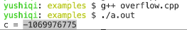
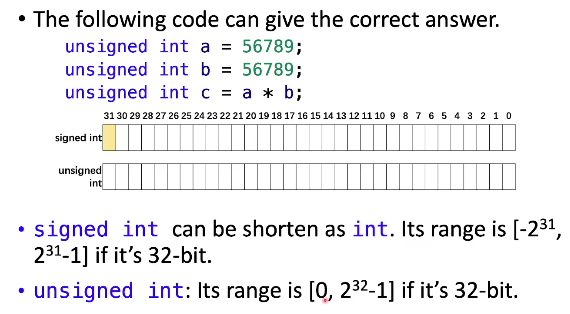
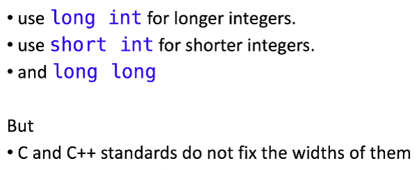
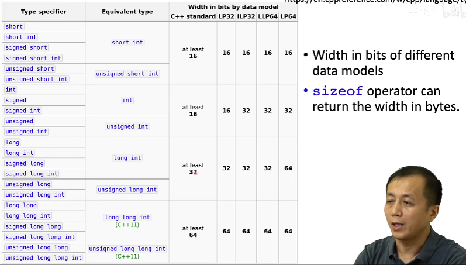
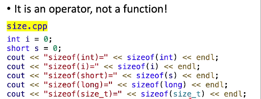
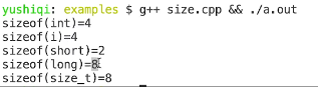

# 整数数据类型

int是常用的整数数据类型

```c++
int i; //声明一个变量
int j = 10; //声明并初始化一个变量
int k;
k = 20; //对一个变量赋值
```

一定要初始化变量！！！

```c++
#include<iostream>
using namespace std;
int main()
{
    int i;
    cout << i << endl;
    return 0;
}
//这一段代码由于没有对变量i初始化，在运行时就会产生问题，输出的值在不同时间不同的=架构的不同操作系统中结果不同
```

## 初始化的三种方式

```c++
int num;
num = 10

int num = 10;

int num (10);

int num {10};
```

## Overflow

```c++
#include<iostream>
using namespace std;

int main()
{
    int a = 56789;
    int b = 56789;
    int c = a * b;
    cout << "c = " << c << endl;
    return 0;
}
```

编译没有出错，运行结果如下



## 有符号和无符号整数

signed int有符号，第一位是符号位

unsigned int没有符号，所有位用来存放数值

在实际应用中，一定要了解运算的数值的范围，避免溢出



在大部分系统中int为32位，但在有的系统上并非如此

## 不同的整数类型



在C和C++中没有对几个整数长度进行规定



## sizeof



使用sizeof可以查看对于变量类型的字节数

上述代码运行结果如下



sizeof看起来像函数，实际为一个操作符