# 更多的整数类型

## char

本质是char是一个八位的整数，因此可以使用signed和unsigned修饰

在不同平台上char默认不一定是signed chat也有可能是unsigned chat

那么我们如何表示一个字符呢？

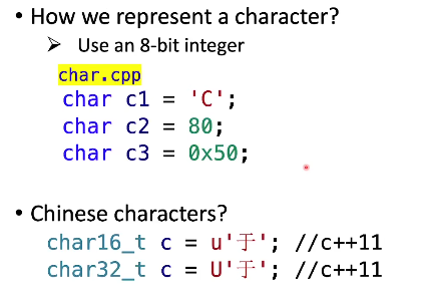

u和U表示类型转换

实例代码如下

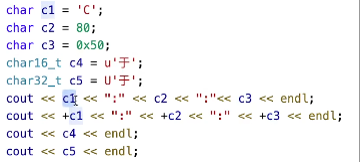

运行结果如下：（注：中文字符的上述表示为C++11标准）

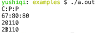

## bool

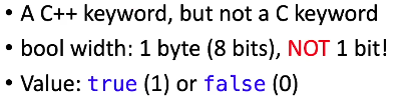

注：bool为C++中的关键词，在C中无法使用

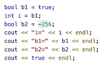

bool中非0即为1,并且bool可以参与运算

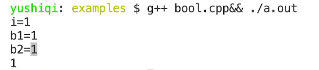

上述代码中实际发生了转换

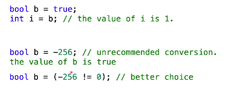

若要在C语言中使用

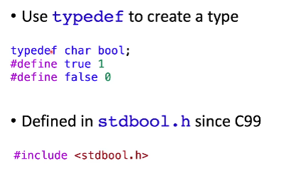

## size_t

改变了为整数，用来表示内存大小，原因如下

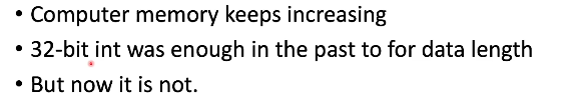

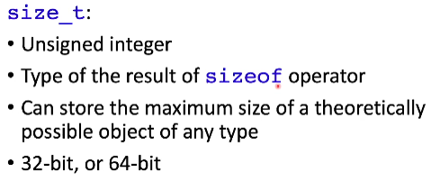

一般使用size_t表达内存元素个数不会出问题

## 解决不同类型整数长度问题（从C++11开始）

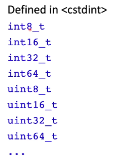

该同文件中还包含一些宏，可以查看不同整数的大小范围，用来辅助选择不同类型

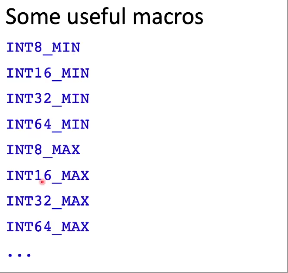

## 选择不同类型的变量原因

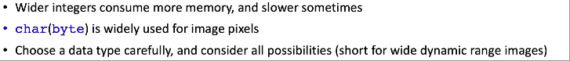

