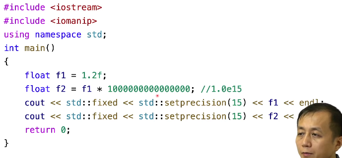
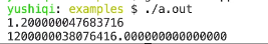
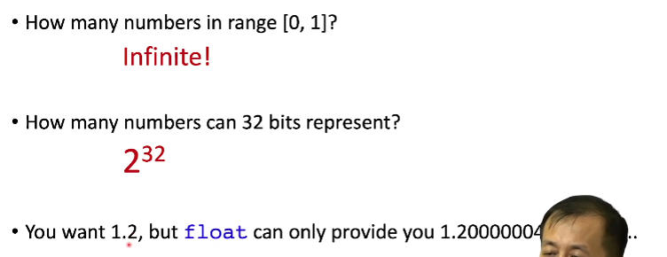
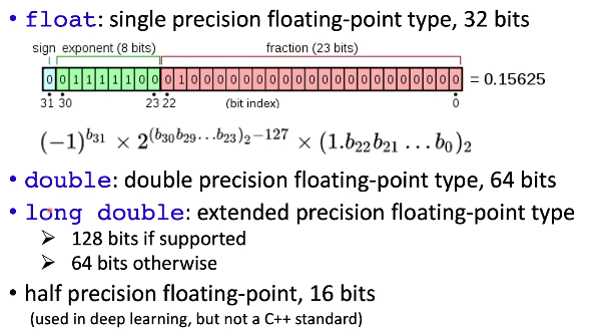
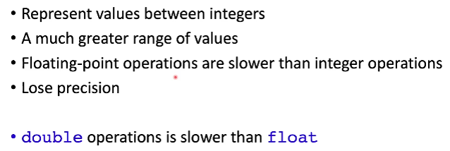
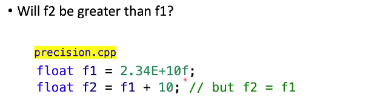
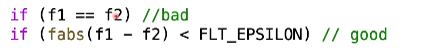
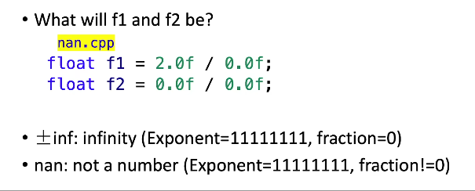

# 浮点数

输出结果如下

由此可得，浮点数并非准确，存在误差

原因如下

计算机无法在32位内表示无穷多的数字，这种误差无法避免，我们需要减少引起这种问题

## 浮点数类型

## 整数浮点数的区别

## 浮点数精度问题

两个数值相同，因为采样精度不够，所以+10对原值没有影响

一般来说不用==判断浮点数是否相同

FLT_EPSILON为宏定义

## inf和nan

