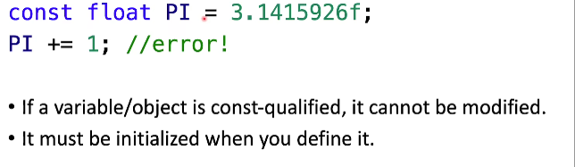
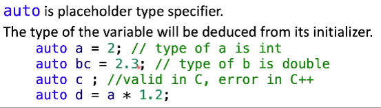
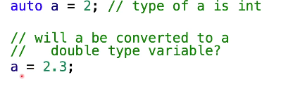
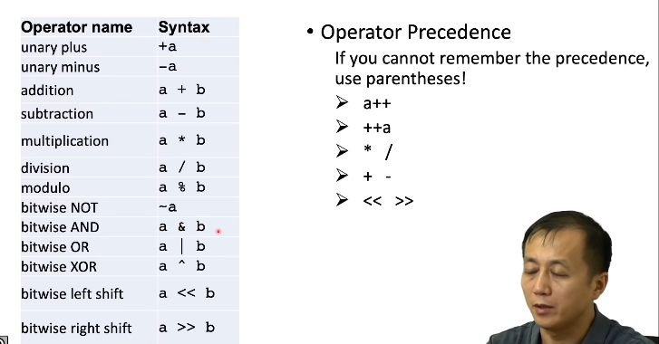
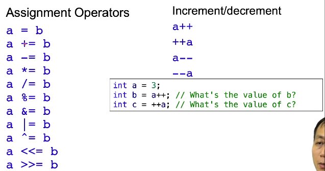
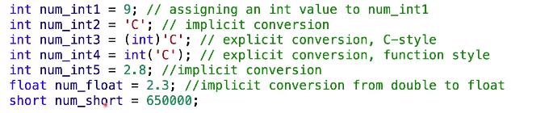
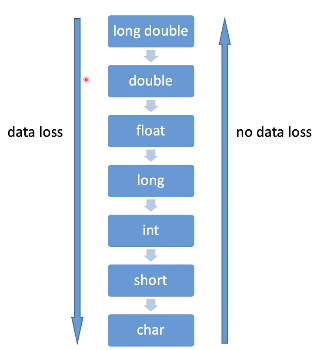
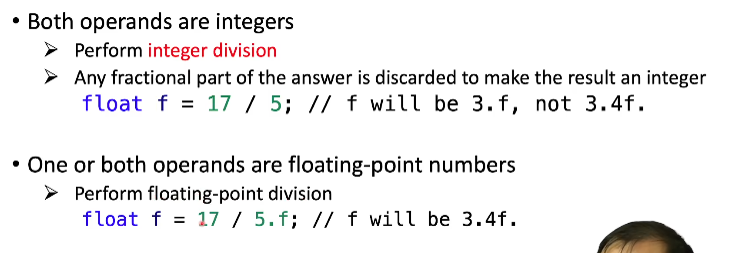
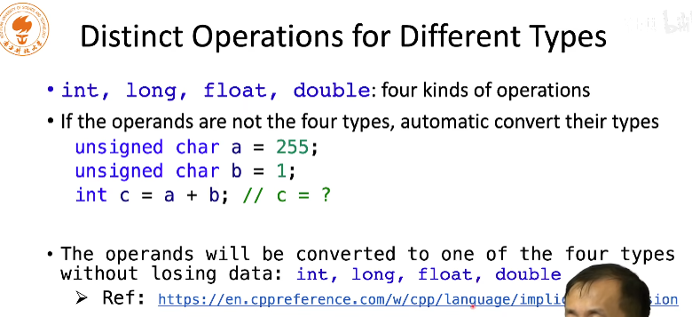

# 算数运算

## 常数

## const类型限定符

## auto（C++11标准）

auto的类型和初始化的赋值类型有关，之后不可更改

在上述代码中，a被赋值double类型的2.3，实际上会将2.3转换为int类型，即为2之后进行赋值操作

## 算术操作符

移位操作比如整数a右移位2,就是乘以2的二次方，左移是除2的二次方，取反会对每一位取反

## 其他运算符

在上述问题中b等于3，c等于4,应为a++会先赋值后自增，++a会先自增后赋值

## 数据类型转换

最后一行输出之后结果为-5360

## 数据损失

## 除法

## 补充

这里c的大小为256，因为在加法运算，会先进行类型转换