# 数组

数组一般是一段连续的内存，这意味着一但数组元素个数确定之后，就不可更改数组元素个数

元素的类型可以为任何基本类型(int, float, bool, etc)，也可以是结构体，类，指针，枚举等

```c++
//arrays.cpp
int num_array1[5]; //数组未初始化，可能为随机数值
int num_array2[5] = {0, 1, 2, 3, 4}; //初始化之后的数组
```

运行结果如下

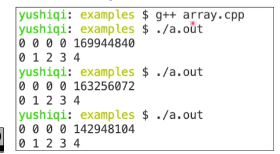

所以一定要进行初始化操作

## 变长数组

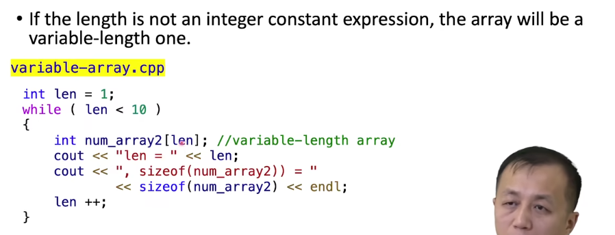

在这段程序中运行结果如下

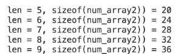

在老旧版本的编译器中无法编译通过，我们可以发现随着len增加，数组长度也增加

对于这个变长数组我们无法在定义中对这个数组进行初始化

## 未知长度数组

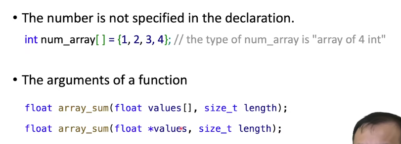

## 数组元素读写

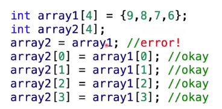

第三行中，数组名字实际上表示数组的首地址，所以不能直接这样赋值，比如逐个元素赋值

## 数组图示

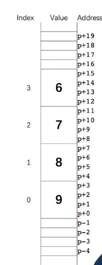

p表示数组的首字节

注意！！！在C/C++中对于数组元素读取时候没有边界检查

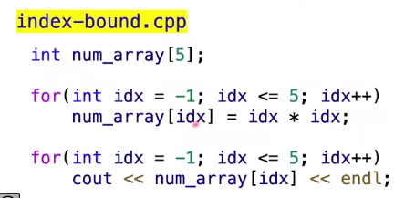

这个语法没有问题，不会产生编译错误

运行结果如下

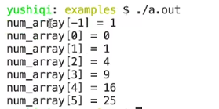

可能会更改其他变量的数值，是一件很危险的事情
在C/C++中数组并不是一个对象，只是一块连续的内存，名字指向数组首地址，需要一个额外变量存储数组的长度

缺点在与代码容易出错

有点在与没有边界检查，带来了更高的性能

## 多维数组

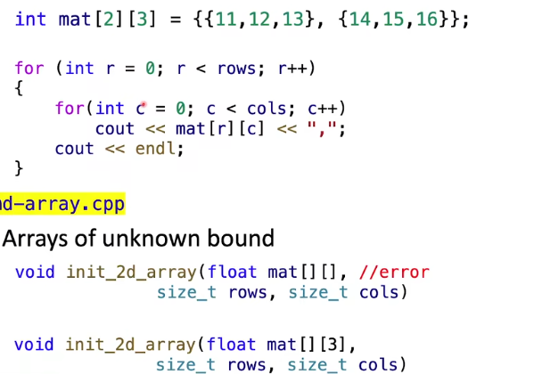

对于二维数组一定要表明数组的列数

### 存储图解

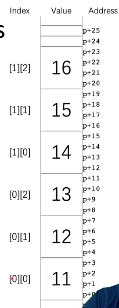

否则无法知道第二行的首地址

在开发中常用一维数组来表示多为数组

## const Arrays

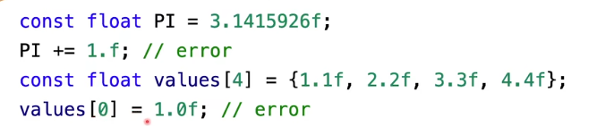

用法

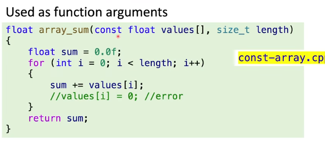

一般用来防止数组元素被修改

调用

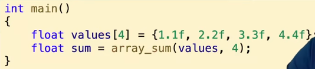