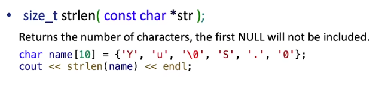

# 字符串

## 数组风格字符串

在字符串中，字符串结束的标志是0,因此第二个字符出现了问题，好的字符串应该是第三个，最后一个\0表示了字符串的结束

上部分代码中输出如下

我们会发现第二个输出出现了错误

因此数组类型字符串一定要添加0

这个函数会输出字符串的长度，字符串的长度和数组长度不相同

在上方代码中输出如下

输出结果为2,是因为当遇到\0时候字符串就结束了

## 字符串类型

第二个字符串和第一个相同，表示了两个字符串的连接

第三个字符串中数组的元素个数为5,因为还需要一个元素来存储\0

上方的char类型没有足够的大小来表示中文或者其他字符，所以我们可以选择下面类型

## 字符串的常见操作

### 拷贝

原理为内存拷贝，第二个可以避免越界

### 拼接

同样也有*strncat()

### 比较

### 示例代码

输出结果如下

输出如下

## string类

string类也没有越界检查