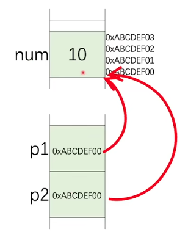

# 指针

指针想变量一样声明，但是在前面有*符号修饰

存储在指针中的是一个地址

操作符&可以取走一个对象或者一个基本类型变量的地址

操作符*可以取到指针指向的内容

```c++
int num = 10;
int * p1 = NULL, * P2 = NULL; // 声明了两个指针，初始化两个指针的值为0
p1 = &num;
p2 = &num; // 取走num的地址，分别赋值给p1和p2

*p1 = 30; //给num赋值30
*p2 = 20; //给num赋值20
```

示意图



## 结构体成员访问

p->member

(*p).member

以上两种写法等价

```c++
struct Student
{
    char name[4];
    int born;
    bool male;
};

Student stu = {"Yu", 2000, true};
Student * pStu = &stu;

strncpy(pStu->name, "Li", 4); //使用strncpy函数来修改stu结构体中成员name的数值
stu->born = 2001;
(*pStu).born = 2002;
pStu.male = false;
```

图示


指针指向了结构体开始的内存地址


我们还可以取到成员的地址

## 指针的指针


## Constant pointers


const在前无法通过指针来修改指针对应变量的值，const在后无法修改指针指向的地址，指针前后都有则两者都不能被修改


