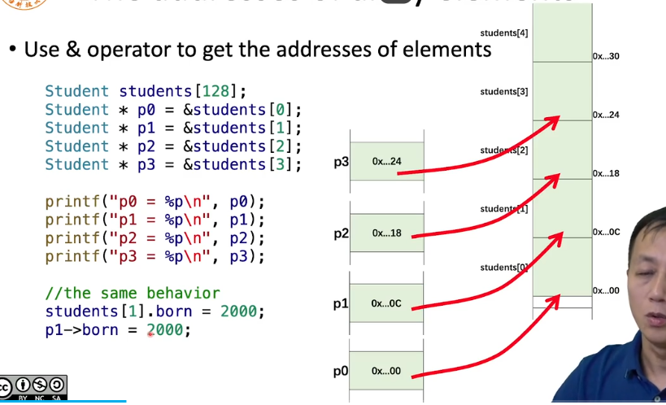
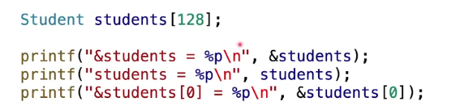
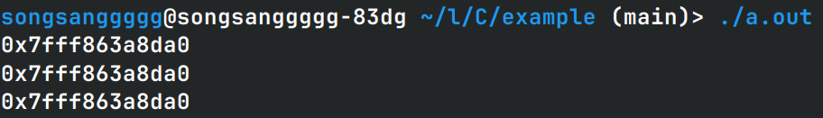
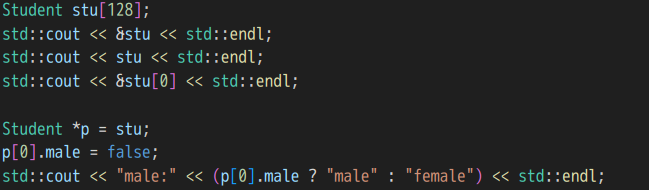
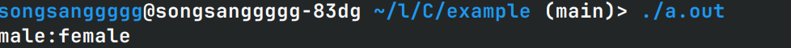
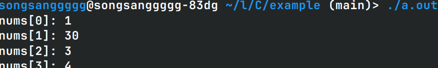
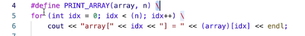
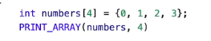
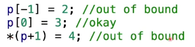

# 指针与数组



在数组中每个元素首地址的偏移量就是每个元素所占的内存大小

## 数组名

我们可以把数组名看作指针



以上三者输出结果都应该相同

对于数组的取值操作并不是指针的指针，所以第一个的输出至

输出结果如下



我们同样可以把数组赋值给指针，并且把指针当作数组操作



输出如下



## 指针的代数操作

指针加一或者减一不是加一个字节或者减一个字节，实际上是加一个元素或者减一个元素

```c++
int nums[4] = {1, 2, 3, 4};

int * p = nums; // 将指针指向nums数组第一个元素的首地址
p++; // 给指针自增加一，此时指针指向了数组中的第二个元素
*p = 30; // 此时数组中的第二个元素数值变成了30，数组为{1, 30, 3, 4}
```

运行结果如下



宏的妙用



调用



在宏中参数array这种必须加括号，安全一点

一定要小心越界！！！



## 指针和数组的不同

数组是一个常量指针，它的地址无法修改

sizeof操作符对于指针和数组的操作，返回结果不同，数组会返回数组所占内存大小，指针会返回4或8,返回的是存指针的内存的大小

指针的大小只有4或8

和操作系统有关

