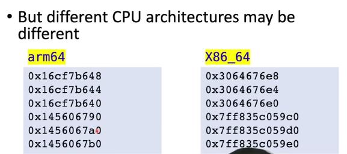

# 动态内存管理（C语言）

## 程序内存

操作系统一般会分为五段

### **bss段：**

　　**bss段（bss segment）**通常是指用来存放程序中未初始化的全局变量的一块内存区域。

　　bss是英文Block Started by Symbol的简称。

　　bss段属于静态内存分配。 

### **data段：**

　　**数据段（data segment）**通常是指用来存放程序中已初始化的全局变量的一块内存区域。

　　数据段属于静态内存分配。 

### **text段：**

　　**代码段（code segment/text segment）**通常是指用来存放程序执行代码的一块内存区域。

　　这部分区域的大小在程序运行前就已经确定，并且内存区域通常属于只读(某些架构也允许代码段为可写，即允许修改程序)。

　　在代码段中，也有可能包含一些只读的常数变量，例如字符串常量等。 

### **堆（heap）：**

　　堆是用于存放进程运行中被动态分配的内存段，它的大小并不固定，可动态扩张或缩减。

　　当进程调用**malloc**等函数分配内存时，新分配的内存就被动态添加到堆上（堆被扩张）；

　　当利用free等函数释放内存时，被释放的内存从堆中被剔除（堆被缩减）。

### **栈(stack)**：

　　 栈又称堆栈，是用户存放程序临时创建的局部变量，

　　也就是说我们函数括弧“{}”中定义的变量（但不包括static声明的变量，static意味着在数据段中存放变量）。

　　除此以外，在函数被调用时，其参数也会被压入发起调用的进程栈中，并且待到调用结束后，函数的返回值也会被存放回栈中。

### 补充：

一般来说，堆栈会相向而行，一般来说栈的地址会越申请越小，堆的地址会越申请越大

```c++
int a = 0;
int b = 0;
int c = 0;
cout << &a << endl;
cout << &b << endl;
cout << &c << endl;
// 以上变量存放在栈中

int * p1 = (int*) malloc (4);
int * p2 = (int*) malloc (4);
int * p3 = (int*) malloc (4);
cout << p1 << endl;
cout << p2 << endl;
cout << p3 << endl;
// 以上变量存放在堆中
```

输出结果如下




## 内存申请

### 申请一个未初始化的内存

```c++
void* malloc(size_t size)
// 我们使用malloc这个函数来在堆上申请内存，传入size_t类型参数来表示内存申请的大小单位为字节数，返回一个指针类型为void,在使用中需要进行类型转换，注意这段内存没有初始化
 
// 申请4字节的并且转化为int类型指针
int * p1 = (int*) malloc (4);

// 问题
int * p1 = (int*) malloc (3);
// 这一段也可以编译通过，我们会申请到三个字节的内存，并且可以正常使用，我们也可以使用第四个字节的内存，因为实际为了内存对齐，会分配十六个字节的内存，但是使用超过三个字节的内存时，会造成越界，是一个不好的习惯
```

## 内存释放

使用函数free

```c++
void free(void* ptr);

// 问题
p = (int *) malloc(4 * sizeof(int));
p = (int *) malloc(8 * sizeof(int));
free (p);
// 在上一部分代码中，我们首先申请了一段内存，并且把内存首地址赋值给了p,第二次我们又申请了一段内存，并且用第二部分内存地址覆盖了前一次申请的内存地址的值，造成了第一次申请内存地址的丢失，并且无法找回并且释放，这样就浪费了第一个申请的内存

// 内存泄漏
void foo()
{
    int * p = (int*) malloc (sizeof(int));
    return;
}
// 上部分代码中p指针对应的内存没有释放，造成了内存泄漏，浪费了内存
```

### 注意！！！

在编程中，我们申请了内存之后一定要寻找一个变量来存储内存的地址，并且在合适的地方释放内存。

```c++
for (int i = 0; i < 1024; i++)
{
    int *p = (int *)malloc(1024 * 1024 * 1024);
}
std::cout << "Finished!" << std::endl;
```

以上代码会浪费1TB的内存，造成严重的内存泄漏，一般会引起程序崩溃，但是由于操作系统内存压缩机制，我们往往能看到最后输出的Finished!