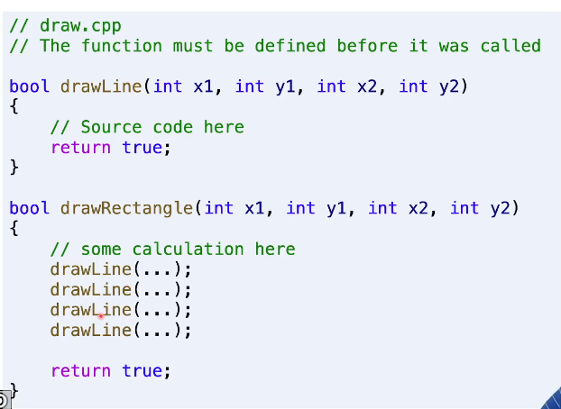
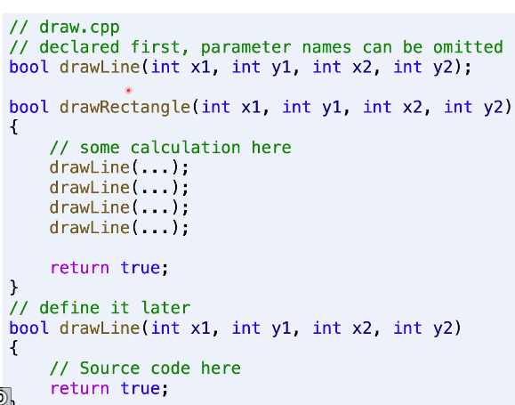
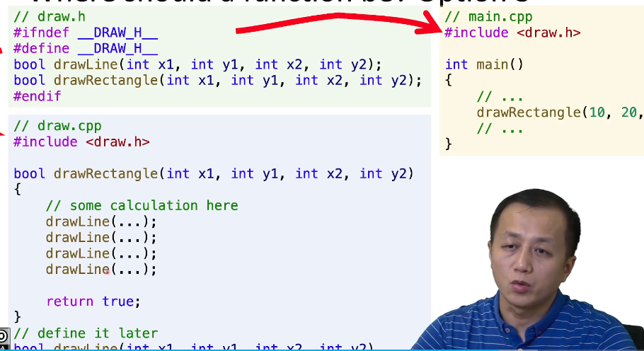
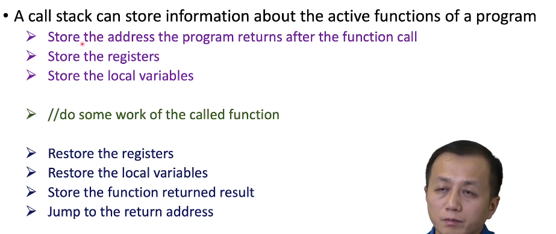

# 函数

## 函数应该放在哪里

函数应该在**被调用之前**声明，例如这样

也可以这样

我们也可以先声明，之后再编写实现函数

在第二个实例中，参数的名称不重要

## 更好的代码结构

上面的预处理指令是为了防止头文件之间循环嵌套，多次定义函数引起编译出错，原理是检查是否有\__DRAW_H__的声明，如果存在就证明该头文件被调用过，那么就不声明函数，如果没有就声明函数并定义\__DRAW_H__，这个定义的名称并不强制，但一般与文件名相关

## 函数是如何调用的

因此函数也有代价