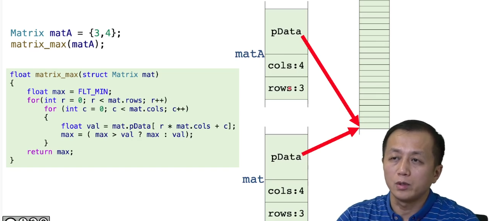
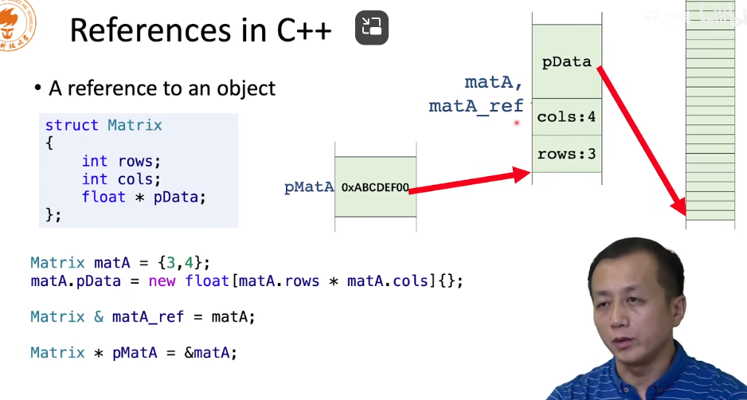
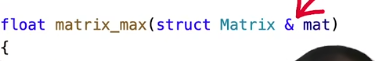

# 函数参数

## 传递参数的方式

### 值传递

```c++
int foo(int x)
{
    x += 10; // 这里x是一个拷贝,在内存中把20的变量拷贝给了x变量
    return x;
}

int main(){
    int num1 = 20;
    int num2 = foo( num1 ); // return x; 也是拷贝，讲数值拷贝给num2
    
    return 0;
}
// 这里num1数值没有被函数操作改变，因为在函数中改变的是另一块内存的数值
```

```c++
int foo(int * p)
{
    (*p) += 10; // 这里传入的数值为num1地址，我们修改了对应内存的数值
    return *p;
}

int main()
{
    int num1 = 20;
    int * p = &num1;
    int num2 = foo( p ); // 因此在调用之后，num1被修改，因为传入的是num1的内存地址，修改的是num1对应内存，所以num1数值改变。这里也是值传递
    
// 但是这里传入的p和函数中的p不相同，只是数值相同,因此如果修改函数中的p指向的内存地址，不影响外部p指向的内存地址
    
    return 0;
}
```

#### 传入结构体



这里传入了一个结构体，其中结构体内容被拷贝了一份，我们在函数中可以修改结构体内容，不会影响函数外传入的结构体，但是由于pData传入的实际上是new出来的数组的地址，我们可以通过该地址修改这个数组内部元素的内容，这样会对函数外结构体中数组元素的数值产生影响

#### 思考

结构体要是很大的话，那么就需要花费很大的内存和时间性能，那么是否会有更好的办法？

### 引用传递

引用是C++中的概念，实际上是对于变量起了一个别名

```c++
int num = 0;
int & num_ref = num; // 我们将num_ref的地址指向num的地址，这样num_ref和num实际上都是同一块内存

num_ref = 10; // 因此当我们操作num_ref的数值时候，对应的num的数值也会改变
```

#### 对象的引用



引用必须要初始化

引用比较安全，初始化时候必须是一个特定的对象，而对于指针就很容易越界

对于前面的思考，解决方式如下

我们可以传入一个指针，传入对象的地址，这样就不用拷贝大量内容，但是十分危险

我们也可以使用引用



但是指针和引用会修改原变量的数值