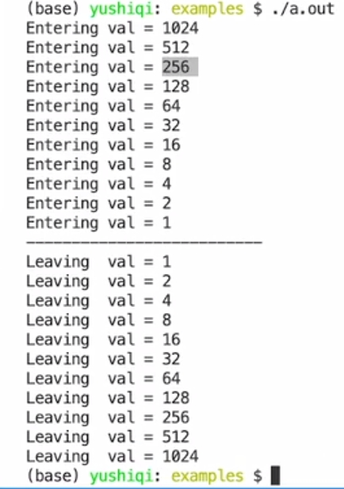

# 递归函数

````c++
int main()
{
    div2(1024.); // 调用递归函数
    return 0;
}

void div2(double val)
{
    cout << "Entering val = " << val << endl;
    
    if(val > 1.0)
        div2(val / 2); // 函数调用自身
    else
        cout << "--------------------" << endl;
    
    cout << "Leaving val = " << val << endl;
}

// 在实际调用中，函数会调用自身，直到最后一个不调用自己的函数中退出，之后进入上一层执行未执行的代码，直到进入最后一层，执行完整个函数并退出
````

输出如下



## 优点

在写一些算法时候，可以使用很少的代码，写出复杂的算法

## 缺点

会消耗很多栈区内存

可能会影响程序性能

很难实现和debug