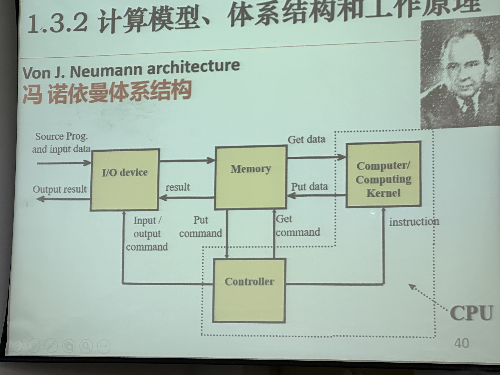

# 计算机与二进制编程

## 1.1-数据与数据思维

### 1.1.1-普遍存在的数据及其价值

**数据**是人们采用某种观测手段，对客观世界中某一实体所表现的特性或状态，数值化描述的结果

**数据**是信息的载体，是知识的源泉

### 1.1.2-知识文明中的数据思维

**文明**：以人类社会化程度，认知能力和所达到的科技水平等表征

**数据思维：**科研工作者对数据的敏感度和抽象表达力，以及数据处理方案的直觉性、熟练度和执行力

## 1.2-数据抽象与问题求解过程算法化

### 1.2.1-问题及问题实例

当多个问题实例共性被提炼，各问题实例的细节便被隐藏。这是对问题的抽象

### 1.2.2-问题求解任务中的算法与数据抽象

**算法：**针对预告问题显式地给出的一组计算步骤或执行指令

**数据抽象：**当一个或一组数据在计算机中以某种确定的类型被表示和记录时，这个过程就是对数据的抽象

### 1.2.3-计算能力与智能能力

### 1.2.4-大数据和“云”之下的数据存储与算力

## 1.3-人类智能的人工实现要素

### 1.3.1-计算思维

**计算思维：**人们用计算机解决问题时需要遵守的一种思考方式，并由此确定一套按步骤顺序执行的计算机解决方案

计算思维是数据思维在计算机世界中的延伸

### 1.3.2-计算模型、体系结构和工作原理

### 1.3.3-计算机中的二进制和机器底层逻辑

### 1.3.4-计算机语言及程序运行方式

## 1.4-C语言