# 映射与函数

## 一.集合

### 1.集合的定义

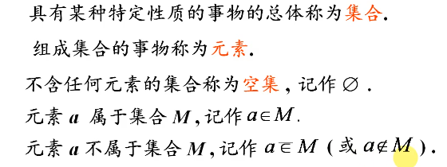

### 2.集合的表示法

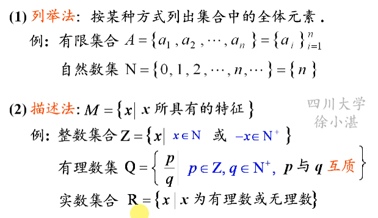

注：有理数集中p和q互质是为了避免相等的分数重复出现

### 3.集合之间的关系及运算

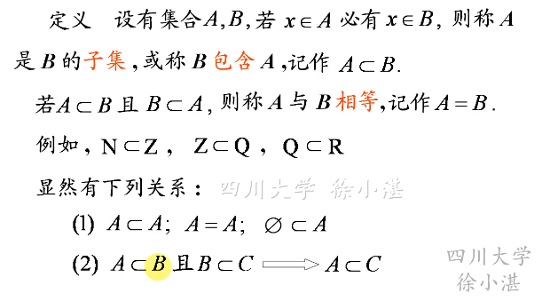

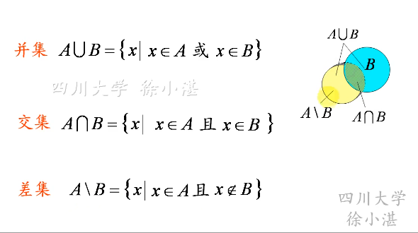

### 4.区间与邻域

#### （1）区间

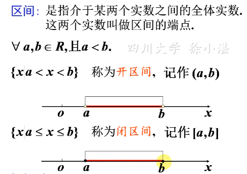

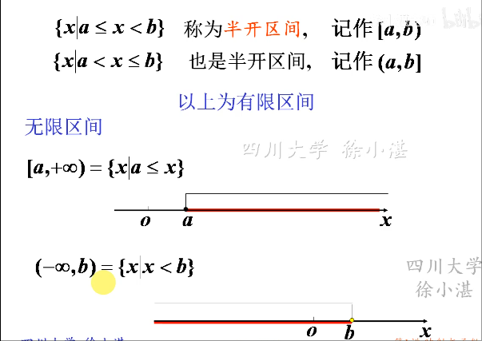

#### （2）邻域

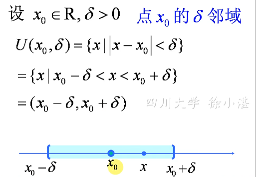

注：邻域一般用于之后极限的描述中

## 二.映射

### 1.映射的概念

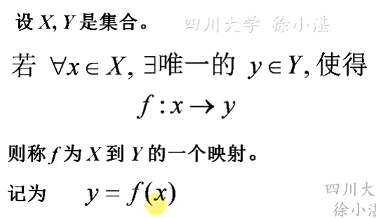

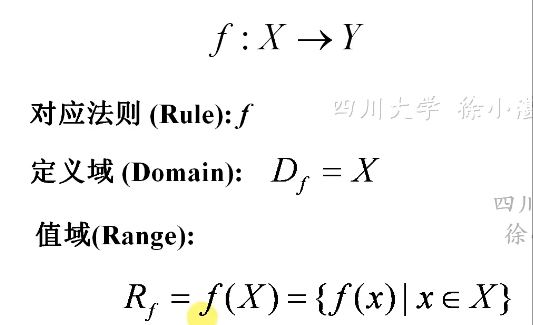

### 2.几种映射的类型

#### （1）满射

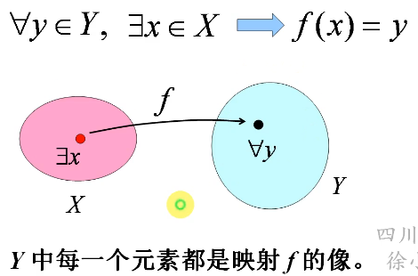

#### （2）非满射

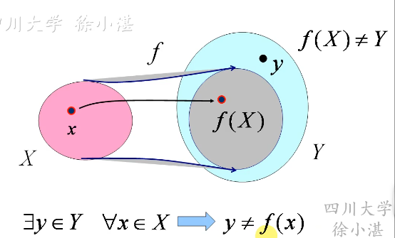

#### （3）单射

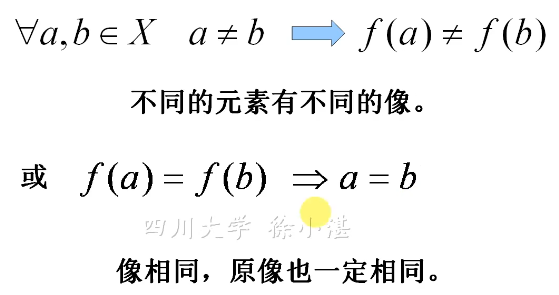

#### （4）非单射

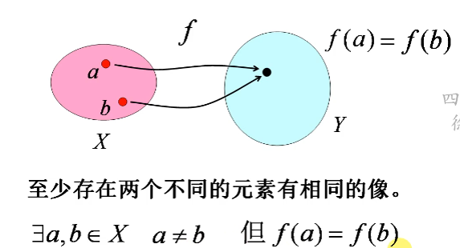

#### （5）双射

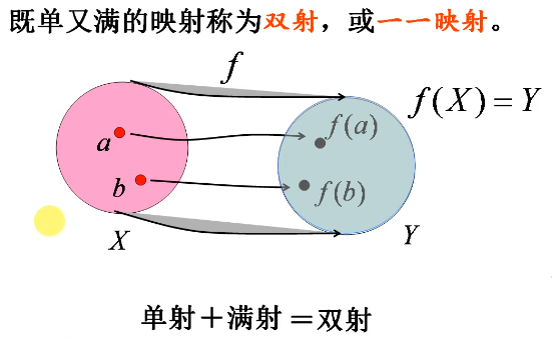

#### 补充 

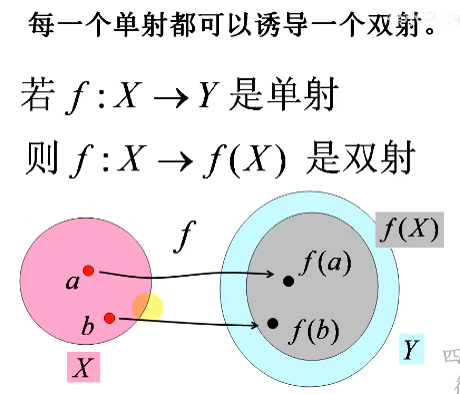

在这个中，f(X)为Y的子集

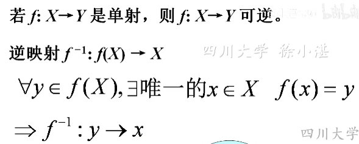

每一个单射都可诱导逆映射

理解：同学对应桌子，桌子就是同学逆映射，此时同学对桌子是单射

​	   但是同学对宿舍，此时同学对宿舍为非单射，那么宿舍无法对应单一同学

## 三.函数

### 1.函数的定义

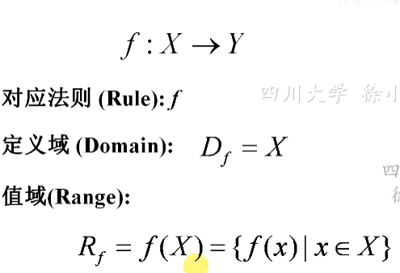

### 3.函数的图像

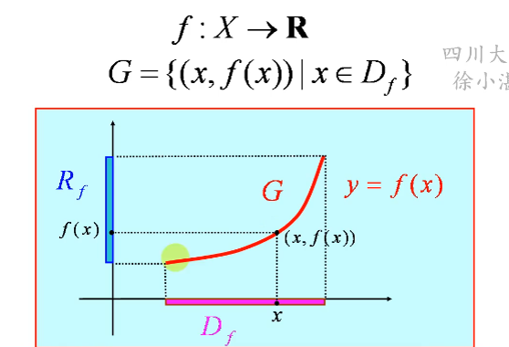

### 4.反函数

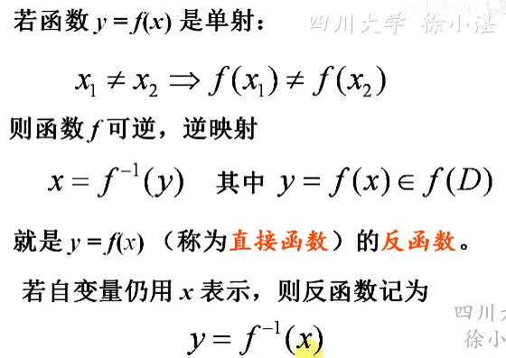

注：单调函数的反函数也是单调函数

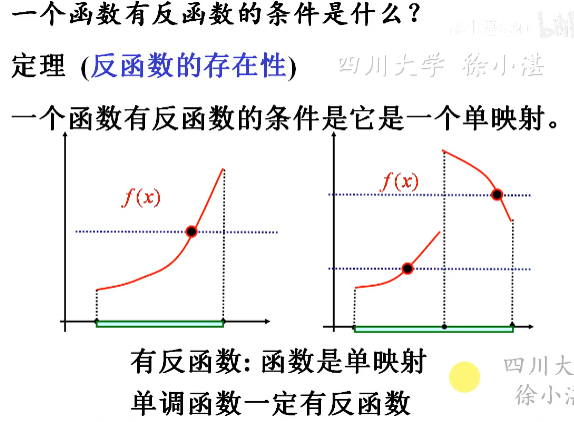

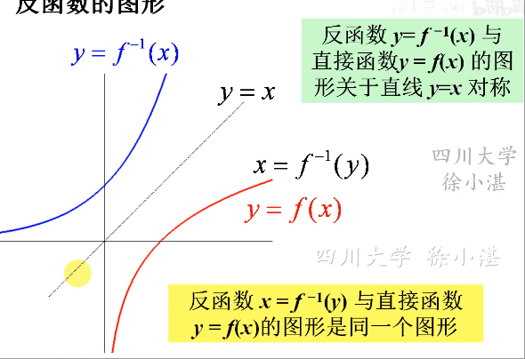

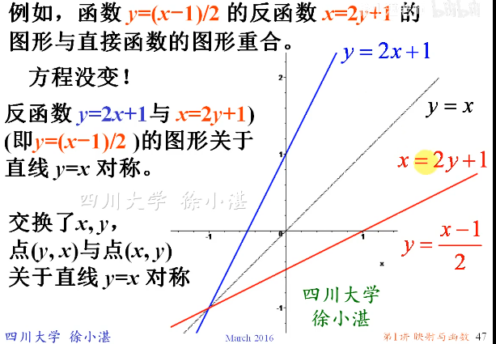