# 几个分段函数

## 概念

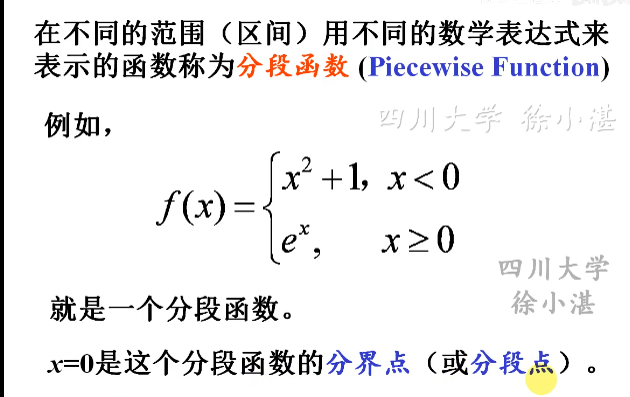

## 绝对值函数

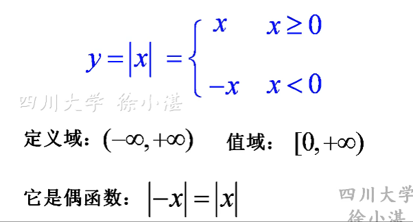

|x| = x与0之间的距离

|x - a| = x与a之间的距离

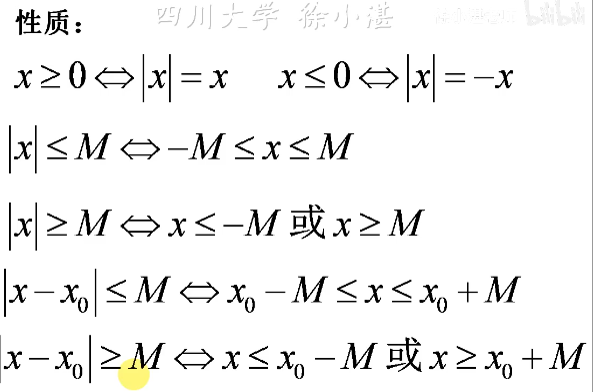

在excel中绝对值函数的表示方法

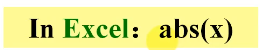

## 符号函数

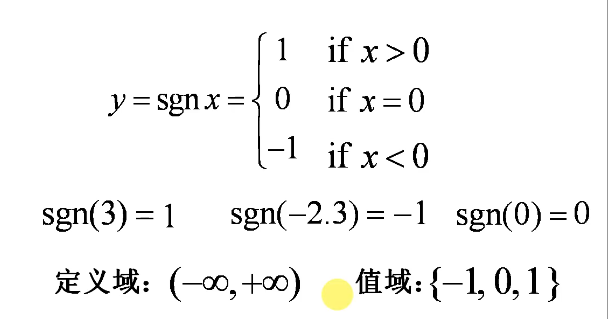

该函数为奇函数

### 性质

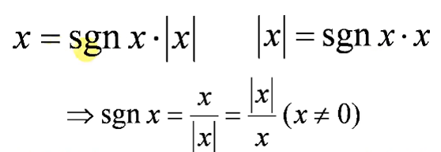

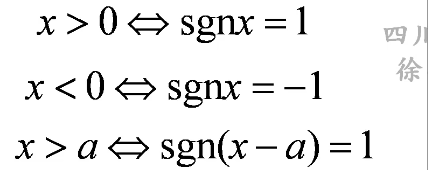

在excel中表示方法

## 取整函数

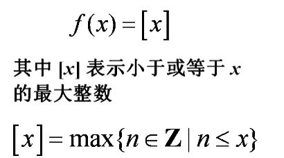怕+

定义域是一切实数，值域是一切整数

### 性质

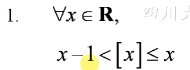

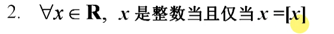

### 图像

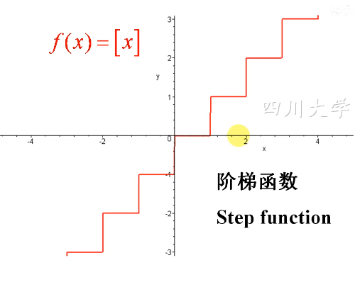

### 为什么是分段函数？

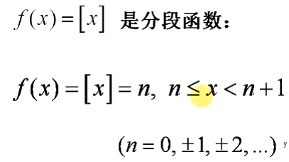

### 取整函数表示

## 其他取整函数

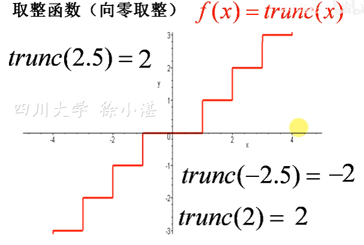

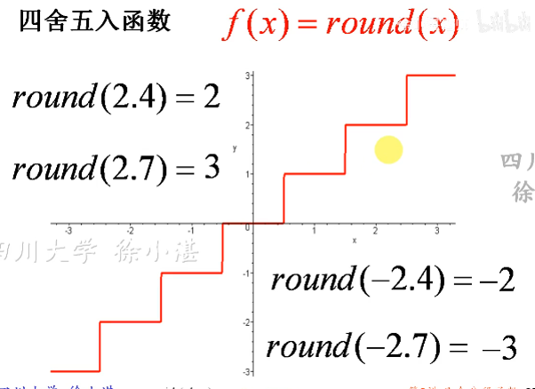